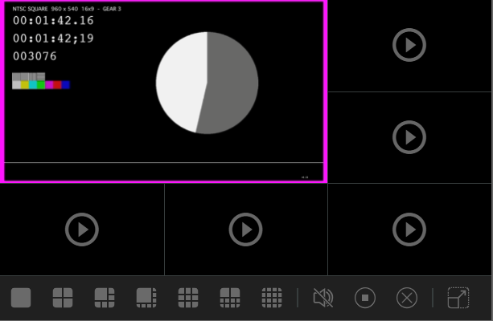

<p align="center">
  <a href="https://www.npmjs.org/package/vue-video-monitor">
    
  </a>
  <a href="LICENSE">
    
  </a>
</p>
# vue-video-monitor

Multi-window vue video player, mp4/flv/m3u8



## Table of Contents

- [Installation](#installation)
- [Usage](#usage)
- [Attributes](#attributes)
- [Methods](#methods)
- [License](#license)


## Installation

VHS supports HLS and DASH and is built into video.js 7, 所以不用安装videojs-contrib-hls， videojs 6可以使用videojs-http-streaming

```sh
npm install --save vue-video-monitor
```

or

```sh
npm install --save video.js videojs-flvjs-es6 flv.js videojs-fetch-flv videojs-contextmenu-pt vue-video-monitor
```


## Usage

To include vue-video-monitor on your website or web application, use any of the following methods.

```vue
<template>
  <div class="video-view center">
    <VueVideoMonitor
      :count="4"
      :control="controlBar"
      :closeAfterViewChange="false"
      :focused="true"
      :duplicate="true"
      ref="monitor"
    />
  </div>
</template>

<script>
import VueVideoMonitor from 'vue-video-monitor'

export default {
  components: {
    VueVideoMonitor
  },
  data() {
    return {
      controlBar: {
        enabled: true,
        position: 'bottom',
        button: [
          '1',
          '4',
          '6',
          '8',
          '9',
          '10',
          '16',
          'mute',
          'stop',
          'clear',
          'fill'
        ]
      }
    }
  },
  methods: {
    controlHide() {
      this.controlBar.enabled = false
    },
    controlShow() {
      this.controlBar.enabled = true
    },
    play() {
      this.$refs.monitor.play({
        src: '//d2zihajmogu5jn.cloudfront.net/bipbop-advanced/gear3/prog_index.m3u8',
        hasAudio: true,
        record: {
          enabled: false,
          isLive: true
        }
      })
    },
    togglefill() {
      this.$refs.monitor.togglefill()
    },
    setViewCount(value) {
      this.$refs.monitor.splitView(value)
    }
  }
}
</script>
<style lang="scss">
.video-view {
  width: 100%;
  max-width: 1280px;
  height: 900px;
}

.center {
  margin: auto;
}
</style>
```


## Attributes

| Property      | Description | Type    | Default              |
| :------------ | ---------- | :------ | :------------------- |
| closeAfterViewChange | Whether to close the playing video when the view window changes | boolean | false |
| control | Control panel parameters | object |  |
| count | Initialize the number of video windows | number | 4 |
| duplicate | Whether to allow multiple identical videos to be played at the same time | boolean | false |
| focused | show focused | boolean | true |


### control object

| Property | Description                                                  | Type    | Default                                                      |
| -------- | ------------------------------------------------------------ | ------- | ------------------------------------------------------------ |
| button   | Configure the buttons on the control panel. <br />['1','4','6','8','9','10','16','25','36','64','fill', 'mute', 'stop','clear'] | array   | ['1','4','6','8','9','10','16','fill','mute', 'stop','clear'] |
| enabled  | Whether to show the control panel                            | boolean | true                                                         |
| position | Control panel position. 'top', 'bottom'                      | string  | bottom                                                       |


## Methods

| Method Name       | Description                              | Param                                     |
| ----------------- | ---------------------------------------- | ----------------------------------------- |
| clear()           | Close all video players that are playing | -                                         |
| mute()            | Mute all players                         | -                                         |
| play(options)     | Play video                               | object                                    |
| splitView(uCount) | Modify the number of video players       | number, 1, 4, 6, 8, 9, 10, 16, 25, 36, 64 |
| stop()            | Stop a video player that is playing      | -                                         |
| togglefill()      | Switch whether the video screen is full  | -                                         |


### play() options object

| Property | Description                                           | Type    | Default                                        |
| -------- | ----------------------------------------------------- | ------- | ---------------------------------------------- |
| hasAudio | With audio                                            | boolean | true                                           |
| record   | Record control parameters(Does not support rtmp/m3u8) | object  | {<br />enabled: true,<br />isLive: true<br />} |
| src      | Media source                                          | string  | -                                              |


## License

MIT. Copyright (c) lin557